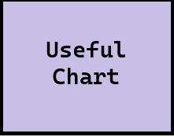

# OLAP

This project illustrates creating a multidemensional data store from which we can query to illustrate the concept of dimensions and metrics.

Cubing concepts (such as slicing, dicing, and drilldowns) are still widely used, although pre-computation of cubes may not be required anymore. Snowflake, Power Bi, Tableau and more can compute as needed using the most up-to-date information sources.

## Data Warehouse Schema and Example Data

**IMPORTANT:** Align OLAP Scripts with Your DW Schema

> Ensure that the OLAP scripts you run are compatible with the schema of your data warehouse.
> **This example uses a schema that will not match yours.**
> Update your scripts to match *your* fact and dimension tables.

#### Dimension Table: `customer`

   - Contains information about customers.
   - Columns (adjust to use your column names):
       - customer_id: Unique identifier for each customer.
       - name: Name of the customer.
       - region: Customer's region (e.g., North, East, West, South).
       - join_date: Date the customer joined.

   Example Rows:

   ```csv
   customer_id,name,region,join_date
   1001,William White,East,2021-11-11
   1002,Wylie Coyote,East,2023-02-14
   1003,Dan Brown,West,2023-10-19
   ```

#### Dimension Table: `product`

   - Contains information about products sold.
   - Columns (adjust to use your column names):
       - product_id: Unique identifier for each product.
       - name: Name of the product.
       - category: Product category (e.g., Electronics, Clothing).
       - unit_price_usd: Price of a single unit (in USD). Including units is valuable.

   Example Rows:

   ```csv
   product_id,name,category,unit_price_usd
   101,laptop,Electronics,793.12
   102,hoodie,Clothing,39.10
   103,cable,Electronics,22.76
   ```


#### Fact Table: sale

   - Contains transactional data for each sale.
   - Columns (adjust to use your column names):
       - sale_id: Unique identifier for each transaction.
       - customer_id: ID of the customer who made the purchase.
       - product_id: ID of the product sold.
       - store_id: ID of the store (additional data example)
       - campaign_id: ID of the active marketing campaign (addl data)
       - sale_date: Date of the sale.
       - sale_amount: Total revenue generated by the transaction (in USD) - this would be better with _usd added - units matter.

   Example Rows:

   ```csv
   sale_id,customer_id,product_id,sale_date,sale_amount
   550,1001,101,2024-01-06,6344.96
   551,1002,102,2024-01-06,312.80
   552,1003,103,2024-01-16,431.00
   ```


#### Example Output: Multidimensional Table (CSV file)

This example outputs a multidimensional data set with the following column names (yours will differ).

```csv
DayOfWeek,product_id,customer_id,sale_amount_sum,sale_amount_mean,sale_id_count,sale_ids
Friday,101,1001,6344.96,6344.96,1,[582]
Friday,102,1009,312.8,312.8,1,[583]
Friday,104,1008,431.0,431.0,1,[593]
```

## Code Examples

### cubing.py

- Connects to the DW.
- Aggregates data into an OLAP cube based on specified dimensions and metrics.
- Saves the multidimensional dataset (cube) to an intermediate CSV file.

### goal_sales_by_day.py

- Loads the precomputed OLAP cube.
- Analyzes sales data to identify patterns, such as total sales by day of the week.
- Outputs actionable insights and visualizations.


## Goal

[Goal: Sales - Low Revenue - by Day of Week](https://github.com/denisecase/smart-sales-analysis-goals/blob/main/example_bi_goals/1-SALES_LOW_REVENUE_DAYOFWEEK.md)

## Results

Which day of the week has the least sales: Friday

**Display Images in Markdown**: To display an image in Markdown use Exclamation Mark, Square Brackets (with caption), then Parentheses (with relative path to the image). See examples below  - adjust the paths when displaying results on the main repository README.md file.



